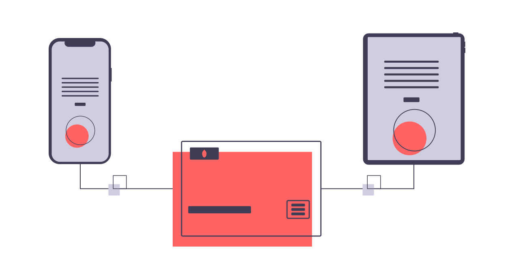
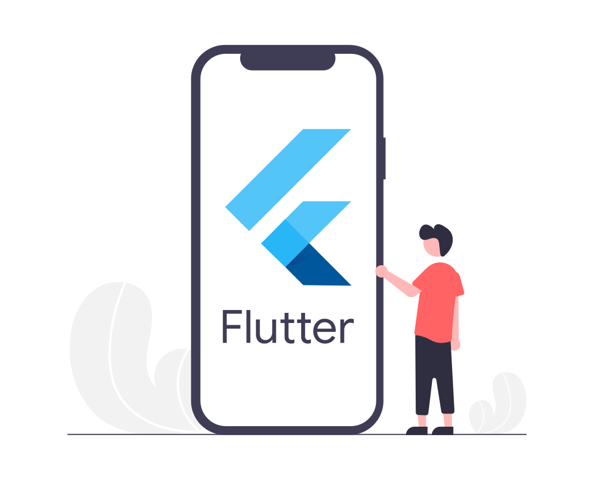
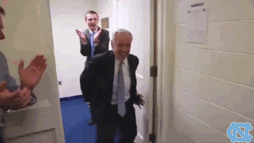

# Flutter Network request: Movie Info App

<h2><strong> Introduction</strong></h2>

Building beautiful apps with minimum code is one of the best pros of using flutter framework. While making apps most times, we have to interact with data from a backend or database. One of the ways through which we interact with this data is through API.

<p align = "center">

</p>

<h2><strong> What is an API</strong></h2>
API is the acronym for Application Programming Interface. API allows data transmission between two software products. It also specifies the terms for this communication. Most mobile applications we use usually communicates with an API to deliver good user experience. Let's delve into the app. 

<p align = "center">

</p>

<h2><strong> Prerequisite</strong></h2>

In order to follow along with this tutorial you must have installed Flutter version 2.10 or higher, android studio and setup up the necessary environment to run your flutter app.
I am using visual studio code as my IDE because it's light weight although you can use android studio or intelliJ IDE to write your codes. Just make sure you have Dart and Flutter plugin installed. For step by step instruction on how to install click on the link below depending on your operating system.

<p align = "center">

</p>

* [Windows](https://www.geeksforgeeks.org/how-to-install-flutter-on-windows/)

* [MacOS](https://www.geeksforgeeks.org/flutter-installation-on-macos/)

* [Linux](https://www.geeksforgeeks.org/how-to-install-flutter-on-linux/)

<h2><strong> About the app</strong></h2>
We are going to build an movie series app showing episodes and other useful data. The series is the popular flash series using an tvmaze api. We are using this API because it is free and open source and doesn't require any API key. To know more about this api click on any of the links below. 

<strong>Note:  At the end of building this app, we can change our TVmaze url endpoint and still get other movies app because they are all similar</strong>

* [TVmaze](https://api.tvmaze.com/)
* [API endpoint](https://api.tvmaze.com/singlesearch/shows?q=flash&embed=episodes)

<h2><strong>Building the app</strong></h2>
As mobile application developers, our main focus is to write well tested apps using best practices as quickly as possible. Most times writing apps requires searching on google, stackoverflow and other developer forums for existing solutions. Sometimes we even use online tools to speed up our app development process.

<h3><strong> Lets start</strong></h2>

1. I will name the app anime_app. Run the code in your terminal 

```cmd
flutter create flash_app
```

If you are using Vscode as your IDE you can do the following to open up your folder quickly in visual studio code.

```cmd
C:\app\app2>cd flash_app

C:\app\app2\flash_app>code .
```

2. If you want to see how the JSON data looks like, click this[API endpoint](https://api.tvmaze.com/singlesearch/shows?q=flash&embed=episodes) which you show you the raw API data. You can copy all the JSON data, then click [Json Formatter](https://jsonformatter.org/). Then paste the JSON file. This will help us understand the type of model we are to create and get general view of our data and decide which of the data we will use in the app.

3. To serialize our JSON data, there are lots of sites which can help us with this. But we will use this site by [Javier Lecuona](https://javiercbk.github.io/json_to_dart/) because it generates a very simple dart model for us. Although we are not using all the data returned.

*Note: Serializing your JSON data determines how easy it is to interact with your API data. Making your JSON simple at this stage will help you work fast.*


4. Applying the same folder structure we had in our quotes app create models, screens and services folders in the lib folder. No need to create assets folder for storing images because we will get them from network requests. Inside the models folder create a models.dart file. Copy your Generated dart and paste in the models.dart file. Then remove the necessary data. remove all the toJson Methods because we are only getting data from the API not posting. After formatting I have only the data left

```dart
class Flash {
  String? name;
  int? runtime;

  ModelImage? image;
  String? summary;
  Embedded? eEmbedded;

  Flash({
    this.name,
    this.runtime,
    this.image,
    this.summary,
    this.eEmbedded,
  });

  Flash.fromJson(Map<String, dynamic> json) {
    name = json['name'];
    runtime = json['runtime'];
    image = json['image'] != null ? ModelImage.fromJson(json['image']) : null;
    summary = json['summary'];
    eEmbedded =
        json['_embedded'] != null ? Embedded.fromJson(json['_embedded']) : null;
  }
}

class ModelImage {
  String? medium;
  String? original;

  ModelImage({this.medium, this.original});

  ModelImage.fromJson(Map<String, dynamic> json) {
    medium = json['medium'];
    original = json['original'];
  }
}

class Embedded {
  List<Episodes>? episodes;

  Embedded({this.episodes});

  Embedded.fromJson(Map<String, dynamic> json) {
    if (json['episodes'] != null) {
      episodes = <Episodes>[];
      json['episodes'].forEach((v) {
        episodes!.add(Episodes.fromJson(v));
      });
    }
  }
}

class Episodes {
  String? name;
  int? season;
  int? number;
  int? runtime;
  ModelImage? image;
  String? summary;

  Episodes({
    this.name,
    this.season,
    this.number,
    this.runtime,
    this.image,
    this.summary,
  });

  Episodes.fromJson(Map<String, dynamic> json) {
    name = json['name'];
    season = json["season"];
    number = json['number'];
    runtime = json['runtime'];
    image = json['image'] != null ? ModelImage.fromJson(json['image']) : null;
    summary = json['summary'];
  }
}

```

5. Then create our HomeScreen and add a scaffold

```dart
import 'package:flutter/material.dart';

class HomeScreen extends StatelessWidget {
  const HomeScreen({Key? key}) : super(key: key);

  @override
  Widget build(BuildContext context) {
    return Scaffold(
      appBar: AppBar(),
    );
  }
}
```
6. Then in our main.dart (which is the root of our application) file import the HomeScreen and add the HomeScreen in the home widget of MaterialApp widget. Also set the debugShowCheckedModeBanner to false.

```dart
import 'package:flash_app/screens/screens.dart';
import 'package:flutter/material.dart';

void main() {
  runApp(const MyApp());
}

class MyApp extends StatelessWidget {
  const MyApp({Key? key}) : super(key: key);

  // This widget is the root of your application.
  @override
  Widget build(BuildContext context) {
    return MaterialApp(
      debugShowCheckedModeBanner: false,
      title: 'Flutter Demo',
      theme: ThemeData(
        primarySwatch: Colors.blue,
      ),
      home: const HomeScreen(),
    );
  }
}
```
7. Next we create our API serices in seervices.dart. We create a class with an asynchronous function which returns a Future of Flash?. *Recall that ? this makes our datatype Nullable.* For our API call we are using the http package. Go to pub.dev and search for http. Then copy the latest version to your pubspec.yaml file and run flutter pub get. ^0.13.4 is the latest version at the time of writing this article.
Then import the http package in the sevices.dart file and use it to get data from the api and then decode the response and map the response to your model file. See code below

```yaml
  http: ^0.13.4
```


```dart
import 'dart:convert';

import 'package:flash_app/models/models.dart';
import 'package:http/http.dart' as http;

class ApiServices {
  Future<Flash?> getMovies() async {
    var url = Uri.parse(
        "https://api.tvmaze.com/singlesearch/shows?q=flash&embed=episodes");
    var response = await http.get(url);
    if (response.statusCode == 200) {
      var result = response.body;
      var decodedRes = jsonDecode(result);
      return Flash.fromJson(decodedRes);
    } else {
      return null;
    }
  }
}
```

8. Let's work on our home screen. Our HomeScreen is a stateful widget and we return a futurebuilder which takes the future we created in our APiServices class. Then we use the switch, case and default statement to check our connection to the state of our connection to the tvMaze api. if our connection is successful, our data is then displayed. If not an elevated button is passed in.

```dart
import 'package:flash_app/models/models.dart';
import 'package:flash_app/services/services.dart';
import 'package:flutter/material.dart';

class HomeScreen extends StatefulWidget {
  const HomeScreen({Key? key}) : super(key: key);

  @override
  State<HomeScreen> createState() => _HomeScreenState();
}

class _HomeScreenState extends State<HomeScreen> {
  @override
  Widget build(BuildContext context) {
    return FutureBuilder(
      future: ApiServices().getMovies(),
      builder: (context, snapshot) {
        switch (snapshot.connectionState) {
          case ConnectionState.waiting:
            return const Center(
              child: CircularProgressIndicator(),
            );
          default:
            if (snapshot.hasError) {
              return Center(
                child: ElevatedButton(
                  onPressed: () {},
                  child: const Text("Oops!!! no internet connection"),
                ),
              );
            } else {
              final series = snapshot.data as Flash;
              return Padding(
                padding: const EdgeInsets.all(8.0),
                child: Container(
                    decoration: BoxDecoration(
                      image: DecorationImage(
                        image: NetworkImage(series.image!.original.toString()),
                        fit: BoxFit.cover,
                      ),
                    ),
                    child: SingleChildScrollView(
                      child: Center(
                        child: Card(
                          elevation: 5,
                          margin: const EdgeInsets.symmetric(
                              horizontal: 10, vertical: 6),
                          color: Colors.transparent,
                          child: Column(
                            crossAxisAlignment: CrossAxisAlignment.center,
                            mainAxisAlignment: MainAxisAlignment.start,
                            children: [
                              const SizedBox(
                                height: 70,
                              ),
                              Text(
                                series.name.toString(),
                                style: const TextStyle(
                                  color: Colors.black,
                                  fontSize: 30,
                                  fontWeight: FontWeight.w900,
                                ),
                              ),
                              const SizedBox(
                                height: 20,
                              ),
                              Text(
                                series.summary.toString(),
                                style: const TextStyle(
                                    color: Colors.white,
                                    fontSize: 20,
                                    fontWeight: FontWeight.w300),
                              ),
                              ElevatedButton(
                                onPressed: () {},
                                child: const Text('Episodes'),
                              )
                            ],
                          ),
                        ),
                      ),
                    )),
              );
            }
        }
      },
    );
  }
}

```

9. Then we create our next screen which is the episodes screen. This is to show us the list of episodes in Gridview format. It takes in three variables episodes, images and _context as shown in the cide below. When any gridview.builder item is tapped the summary() function is called whic returns a showdialog with summary of that episode.

```dart
import 'package:flash_app/models/models.dart';
import 'package:flutter/material.dart';

class EpisodesScreen extends StatelessWidget {
  final List<Episodes> episodes;
  final ModelImage images;
  late BuildContext _context;
  EpisodesScreen({
    Key? key,
    required this.episodes,
    required this.images,
  }) : super(key: key);
//Dialog for displaying summary
  summary(String? summary) {
    showDialog(
        context: _context,
        builder: (context) => Center(
              child: Padding(
                padding: const EdgeInsets.all(12.0),
                child: Card(
                  color: Colors.red.withOpacity(0.8),
                  child: Padding(
                    padding: const EdgeInsets.all(12.0),
                    child: Text(
                      summary.toString(),
                      style: const TextStyle(
                          color: Colors.white,
                          fontSize: 16,
                          fontWeight: FontWeight.w600),
                    ),
                  ),
                ),
              ),
            ));
  }

  @override
  Widget build(BuildContext context) {
    _context = context;
    return Scaffold(
      extendBodyBehindAppBar: true,
      appBar: AppBar(
        title: const Text("Flash Episodes"),
        centerTitle: true,
        backgroundColor: const Color.fromARGB(158, 214, 22, 22),
        elevation: 0,
      ),
      body: Container(
        decoration: BoxDecoration(
          image: DecorationImage(
            image: NetworkImage(images.original.toString()),
            fit: BoxFit.cover,
          ),
        ),
        child: Padding(
          padding: const EdgeInsets.all(8.0),
          child: GridView.builder(
              gridDelegate: const SliverGridDelegateWithFixedCrossAxisCount(
                crossAxisCount: 2,
                childAspectRatio: 1.0,
              ),
              itemCount: episodes.length,
              itemBuilder: (context, index) => InkWell(
                    onTap: () {
                      summary(episodes[index].summary);
                    },
                    child: Card(
                      child: Stack(
                        fit: StackFit.expand,
                        children: [
                          Image.network(
                            episodes[index].image!.original!,
                            fit: BoxFit.cover,
                          ),
                          Padding(
                            padding: const EdgeInsets.all(8.0),
                            child: Column(
                              mainAxisAlignment: MainAxisAlignment.end,
                              children: [
                                Text(
                                  episodes[index].name!,
                                  style: const TextStyle(
                                      fontWeight: FontWeight.bold,
                                      color: Colors.white,
                                      fontSize: 15.0),
                                )
                              ],
                            ),
                          ),
                          Positioned(
                            top: 0.0,
                            left: 0.0,
                            child: Padding(
                              padding:
                                  const EdgeInsets.symmetric(horizontal: 10),
                              child: Row(
                                crossAxisAlignment: CrossAxisAlignment.start,
                                mainAxisSize: MainAxisSize.max,
                                mainAxisAlignment: MainAxisAlignment.center,
                                children: [
                                  Container(
                                    color: Colors.black,
                                    child: Text(
                                      " Season ${episodes[index].season.toString()}",
                                      style: const TextStyle(
                                        color: Colors.white,
                                        fontSize: 15,
                                        fontWeight: FontWeight.bold,
                                      ),
                                    ),
                                  ),
                                  Container(
                                    color: Colors.red,
                                    child: Text(
                                      " Episode ${episodes[index].number.toString()}",
                                      style: const TextStyle(
                                        color: Colors.white,
                                        fontSize: 15,
                                        fontWeight: FontWeight.bold,
                                      ),
                                    ),
                                  ),
                                ],
                              ),
                            ),
                          )
                        ],
                      ),
                    ),
                  )),
        ),
      ),
    );
  }
}
```

10. Next we add Navigation from our home page to the episodes page and then add setstate(){} function for reloading our application. The final code for the home screen is

```dart
import 'package:flash_app/models/models.dart';
import 'package:flash_app/screens/episodes.dart';
import 'package:flash_app/services/services.dart';
import 'package:flutter/material.dart';

class HomeScreen extends StatefulWidget {
  const HomeScreen({Key? key}) : super(key: key);

  @override
  State<HomeScreen> createState() => _HomeScreenState();
}

class _HomeScreenState extends State<HomeScreen> {
  @override
  Widget build(BuildContext context) {
    return FutureBuilder(
      future: ApiServices().getMovies(),
      builder: (context, snapshot) {
        switch (snapshot.connectionState) {
          case ConnectionState.waiting:
            return const Center(
              child: CircularProgressIndicator(),
            );
          default:
            if (snapshot.hasError) {
              return Center(
                child: ElevatedButton(
                  onPressed: () {
                    setState(() {
                      snapshot.hasData;
                    });
                  },
                  child: const Text("Oops!!! no internet connection"),
                ),
              );
            } else {
              final series = snapshot.data as Flash;
              return Padding(
                padding: const EdgeInsets.all(8.0),
                child: Container(
                    decoration: BoxDecoration(
                      image: DecorationImage(
                        image: NetworkImage(series.image!.original.toString()),
                        fit: BoxFit.cover,
                      ),
                    ),
                    child: SingleChildScrollView(
                      child: Center(
                        child: Card(
                          elevation: 5,
                          margin: const EdgeInsets.symmetric(
                              horizontal: 10, vertical: 6),
                          color: Colors.transparent,
                          child: Column(
                            crossAxisAlignment: CrossAxisAlignment.center,
                            mainAxisAlignment: MainAxisAlignment.start,
                            children: [
                              const SizedBox(
                                height: 70,
                              ),
                              Text(
                                series.name.toString(),
                                style: const TextStyle(
                                  color: Colors.black,
                                  fontSize: 30,
                                  fontWeight: FontWeight.w900,
                                ),
                              ),
                              const SizedBox(
                                height: 20,
                              ),
                              Text(
                                series.summary.toString(),
                                style: const TextStyle(
                                    color: Colors.white,
                                    fontSize: 20,
                                    fontWeight: FontWeight.w300),
                              ),
                              ElevatedButton(
                                onPressed: () {
                                  Navigator.push(
                                    context,
                                    MaterialPageRoute(
                                      builder: ((context) => EpisodesScreen(
                                            episodes:
                                                series.eEmbedded!.episodes!,
                                            images: series.image!,
                                          )),
                                    ),
                                  );
                                },
                                child: const Text('Episodes'),
                              )
                            ],
                          ),
                        ),
                      ),
                    )),
              );
            }
        }
      },
    );
  }
}
```
Voila you can run your app and see your flash series app.

<p align = "center">

</p>


https://user-images.githubusercontent.com/31783214/172046534-e031582d-2669-453a-830c-2cd19486b4f0.mp4


<h2><strong>Summary</strong></h2>
In this article we saw how to make simple network request with http.get as well as other interesting thing. One key thing to note about this app is that it can also be used for other TVmaze series just by changing the API movie title

```
"https://api.tvmaze.com/singlesearch/shows?q=flash&embed=episodes

you can change flash to any other movie included in the tvmaze API and get your app which is similar to what we did.
```


let's try changing the url of our Apiservices() class in services.dart with any of this url and run our app

```
https://api.tvmaze.com/singlesearch/shows?q=girls&embed=episodes
https://api.tvmaze.com/singlesearch/shows?q=orville&embed=episodes
https://api.tvmaze.com/singlesearch/shows?q=boys&embed=episodes
https://api.tvmaze.com/singlesearch/shows?q=24&embed=episodes
https://api.tvmaze.com/singlesearch/shows?q=superman&embed=episodes
https://api.tvmaze.com/singlesearch/shows?q=naruto&embed=episodes
https://api.tvmaze.com/singlesearch/shows?q=avatar&embed=episodes
```
see example here I changed to the naruto anime api endpoint
```dart
class ApiServices {
  Future<Flash?> getMovies() async {
    var url = Uri.parse(
        "https://api.tvmaze.com/singlesearch/shows?q=naruto&embed=episodes");
    var response = await http.get(url);
    if (response.statusCode == 200) {
      var result = response.body;
      var decodedRes = jsonDecode(result);
      return Flash.fromJson(decodedRes);
    } else {
      return null;
    }
  }
}
```


https://user-images.githubusercontent.com/31783214/172046562-56b8debd-fd32-4225-b9e0-5ccafe828c37.mp4


<h2><strong>Final note</strong></h2>
So with this app tutorial you can create multiple series summary apps using the tvmaze endpoint since they have similar json response format and hence similar models.
Depending on your time you can checkout Tv maze for all your favorite series and build an app for them you can share to me on [codenjobs](https://www.codenjobs.com/)

In our next article will see how to make request when there's an API key then so stay tuned for more 
Hope you learned a lot. You can reach out to me on [codenjobs](https://www.codenjobs.com/user/tripster) to get the code and try to reproduce this using series movie in tvMaze.
 
